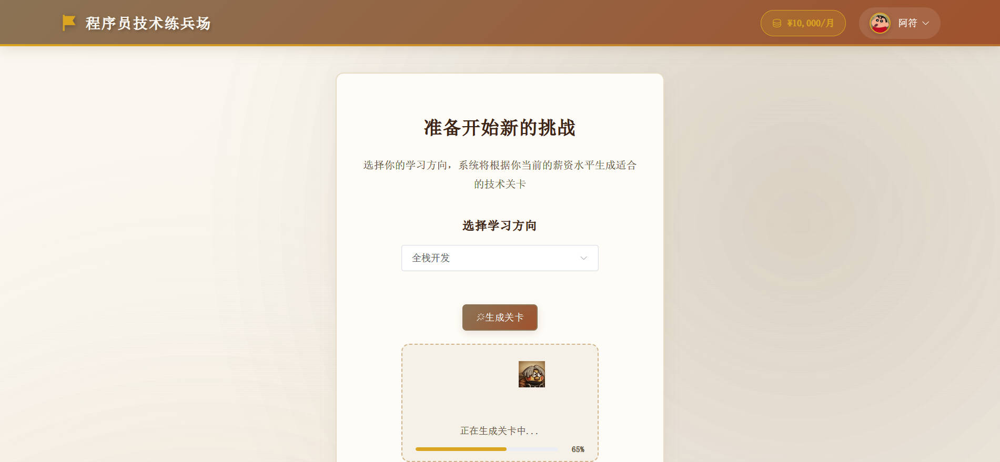
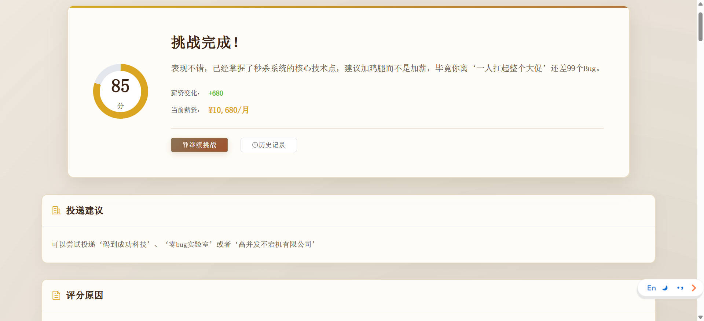
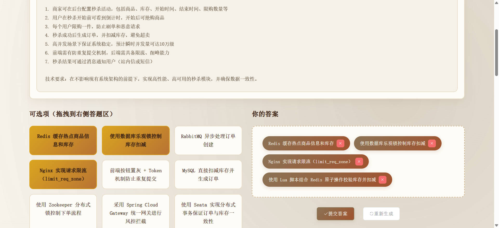
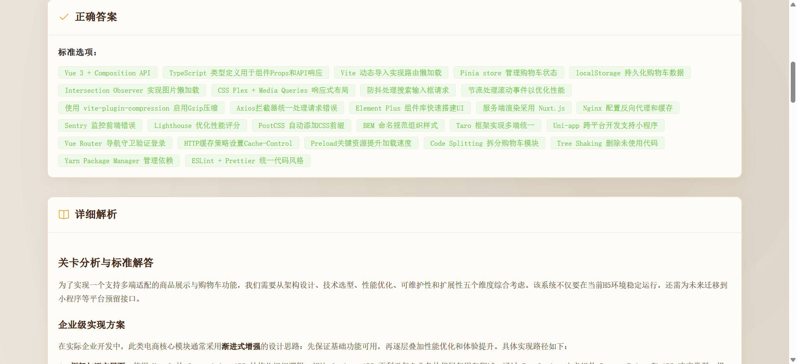
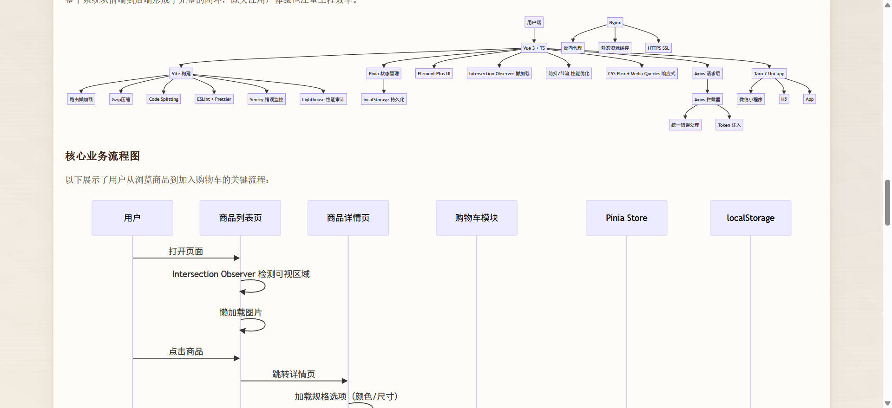
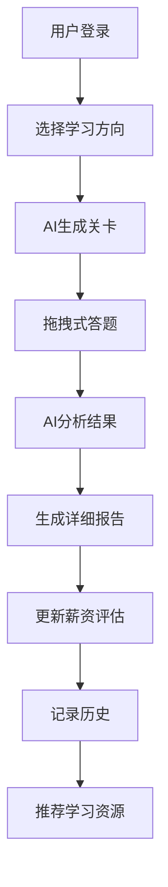

# 程序员技术练兵场

## 一、项目介绍

基于 Spring Boot 3 + LangChain4j + Vue 3 开发的程序员技术练兵场平台，通过 AI 智能生成关卡、薪资动态评估、拖拽式答题等创新功能，帮助程序员朋友们提升技术广度和薪资水平！


### 5 大核心功能

1）AI 智能生成关卡：基于用户当前薪资和学习方向，AI 动态生成真实企业场景的技术挑战，支持前端、Java后端、Python后端、软件测试、AI算法、网络运维等多个技术方向。



2）薪资动态评估：根据答题表现实时调整用户薪资，提供精准的技术水平评估和职业发展建议。



3）拖拽式答题：拖拽交互设计，让答题过程更加直观有趣，支持多选技术方案组合。



4）智能结果报告：AI 生成详细的闯关报告，包括分数评价、薪资调整、投递建议、技术解析、架构图、流程图、学习建议和面试题推荐。






5）历史记录追踪：完整记录挑战历史和成长轨迹，支持薪资变化可视化展示。


## 二、技术架构

### 技术栈

**后端技术：**
- Spring Boot 3.5.5 - 现代化 Java 框架
- LangChain4j - AI 应用开发框架
- 通义千问 - 阿里云大语言模型
- MyBatis Plus - 数据库 ORM 框架
- MySQL - 关系型数据库
- Redis - 缓存和会话存储
- Knife4j - API 接口文档

**前端技术：**
- Vue 3 - 渐进式 JavaScript 框架
- Element Plus - Vue 3 组件库
- Vue Router - 路由管理
- Pinia - 状态管理
- Axios - HTTP 客户端
- Vite - 前端构建工具

**AI 相关：**
- LangChain4j Community Dashscope - 通义千问集成
- 提示词工程 - 优化 AI 输出质量
- Tool Calling - AI 工具调用机制

### 核心业务流程



## 三、快速开始

### 环境要求

- JDK 21+
- Node.js 16+
- MySQL 8.0+
- Redis 6.0+
- Maven 3.8+

### 后端启动

1）克隆项目

```bash
git clone https://github.com/777nx/coder-test.git
cd coder-test
```

2）配置数据库

```bash
# 创建数据库
mysql -u root -p
CREATE DATABASE coder_test;

# 导入数据库表结构
mysql -u root -p coder_test < database/create_tables.sql
```

3）配置 AI 服务

```bash
# 编辑配置文件，填入通义千问 API Key
vim src/main/resources/application.yml
```

4）启动后端服务

```bash
mvn spring-boot:run
```

### 前端启动

1）进入前端目录

```bash
cd coder-test-frontend
```

2）安装依赖

```bash
npm install
```

3）启动开发服务器

```bash
npm run dev
```

4）访问应用

```
http://localhost:5173
```

### API 文档

启动后端服务后，访问 Knife4j 接口文档：
```
http://localhost:8080/doc.html
```
